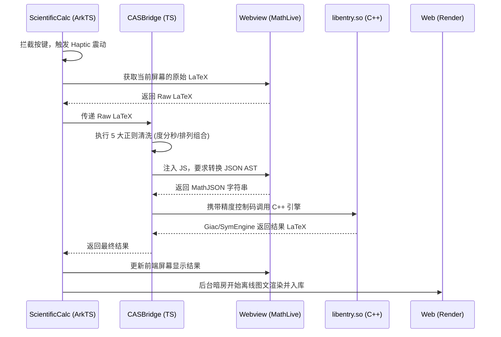

# 🏛️ CalculatorX 系统架构指南 (Architecture)

本文档详细阐述了 CalculatorX 的核心架构设计、模块职责边界以及跨端数据流转机制。无论你是想要了解项目底层逻辑的极客，还是准备为本项目贡献代码的开发者，阅读本文档都将帮助你快速建立对系统的全局认知。


## 1. 核心设计哲学：单页面应用 (SPA) 与“壳-插件”模型

为了在移动端实现极致的沉浸感和丝滑的模块切换体验，CalculatorX 彻底摒弃了传统的“多页面路由（Router Push）”跳转模式，采用了类似于桌面端大型软件的**“单页面应用 (SPA) + 壳与插件”**架构。

* **壳 (Shell) - `pages/Index.ets`**：
  充当系统的主板和全局容器。它仅负责渲染全局始终存在的基础设施：悬浮顶栏 (`TopBar`)、手势侧边栏 (`SideBarMenu`) 以及历史记录全局遮罩 (`HistorySheet`)。它的内部预留了一个“动态插槽”。
* **插件 (Plugins) - `components/*Calc.ets`**：
  科学计算 (`ScientificCalc`)、基础计算 (`BasicCalc`) 等具体业务面板被设计为完全独立的组件（即“插件”）。它们就像插在主板上的独立显卡，当用户在侧边栏切换功能时，`Index.ets` 只是在插槽中动态替换这些组件，从而实现了零路由延迟的无缝切换。


## 2. 模块职责地图

在 `entry/src/main/ets/` 目录下，我们的代码被严格划分为三个层级：

### 🧱 视图容器层 (pages)
* **`Index.ets`**：全局唯一主入口，负责处理组件的动态挂载和系统级返回逻辑。
* **`history/HistoryManager.ets`**：全局全屏历史检索页，用于处理跨模块的海量计算记录检索。

### 🧩 独立业务层 (components)
* **`ScientificCalc.ets`**：科学计算器核心插件。内部高度内聚了专属的双键盘 (`TopKeyboard`, `BottomKeyboard`) 和双 Webview（前端显示屏与后台暗房）。
* **基础 UI 库**：如 `TopBar`, `SideBarMenu`, `MenuComponents`，提供无状态的纯 UI 积木。

### 🧠 核心服务层 (utils & database)
彻底剥离了与 UI 无关的底层逻辑：
* **`CASBridge.ets`**：C++ 引擎的专属通信中枢。负责接收原始 LaTeX，执行严格的防御性正则清洗（如度分秒、排列组合防御），并将清洗后的数据注入 Webview 获取 MathJSON AST，最终调用 N-API。
* **`HapticUtils.ets`**：全局触控震感中心，根据按键类型（如高权重按键 `=` 与普通数字）动态匹配 Hard/Sharp/Soft 震动曲线。
* **`HistoryRepository.ets`**：基于 RDB 的本地持久化数据库，负责计算图文记录的异步存取。


## 3. 计算生命周期与跨端数据流转

当用户在科学计算器上点击 `=` 号时，系统内部会经历极其精密的数据流转：



## 4. 状态隔离机制

为了防止业务膨胀导致的状态混乱，系统实行极其严格的状态边界管控：

* **禁止全局污染**：像 `lastAnsLatex` (上一次结果)、`lastValidJson` (上一次合法 AST)、`isShift` (功能键状态) 等变量，**必须**使用 `@State` 封锁在各自的业务组件（如 `ScientificCalc`）内部。
* **按需使用 AppStorage**：只有像 `isRad` (全局角度制)、`navBarHeight` (系统导航条避让高度)、`hapticFeedback` (震动总开关) 这种所有模块共用的物理/全局属性，才允许挂载到 `AppStorage` 中。
* **事件总线 (EventHub)**：遇到跨层级通信（例如 `Index` 中的 `TopBar` 触发撤销，需要通知 `ScientificCalc` 内的 Webview），使用 `getContext().eventHub.emit` 进行无耦合广播。


## 5. 核心目录结构

本项目严格遵循“壳与插件 (Shell & Plugin)”设计模式，UI 视图、纯逻辑服务与底层引擎实现了完美解耦：

```text  
entry/src/main/  
├── ets/                               # 📱 ArkTS 前端逻辑与视图层  
│   ├── pages/                         # 🧭 全局页面与骨架层 (Shell)
│   │   ├── Index.ets                  # 主枢纽：负责动态挂载业务插件与全局路由
│   │   ├── history/HistoryManager.ets # 全局历史检索页：支持全功能 Tab 切换
│   │   └── settings/                  # 设置模块
│   │
│   ├── components/                    # 🧩 独立业务插件与 UI 积木层
│   │   ├── ScientificCalc.ets         # 科学计算器核心面板 (高度内聚的独立插件)
│   │   ├── TopBar.ets                 # 顶部悬浮控制栏 (搭载动态状态岛)
│   │   ├── HistorySheet.ets           # 局部历史半模态抽屉
│   │   ├── *Keyboard.ets              # 科学计算/基础数字双键盘
│   │   └── SideBarMenu.ets            # 手势驱动的侧边栏菜单
│   │
│   ├── utils/                         # 🧠 核心服务与纯逻辑层
│   │   ├── EngineService.ets           # CAS 引擎中枢：正则清洗、AST 解析及 N-API 调度
│   │   ├── HapticUtils.ets             # 触控震感中心：全局接管 Hard/Sharp/Soft 马达曲线
│   │   └── CalculatorConfigs.ets      # 全局配置与状态映射
│   │
│   └── database/HistoryRepository.ets # 关系型数据库 (RDB) 调度中心
│  
├── cpp/                               # ⚙️ C++ 计算机代数系统 (CAS) 引擎层
│   ├── CMakeLists.txt                 # N-API 构建与静态链接脚本
│   ├── engine.cpp                     # AST 树解析与精度控制枢纽
│   ├── FastMath.cpp/h                 # 极速降维模块：O(1) 时间计算宇宙级超大数
│   ├── ErrorHandler.h                 # 异常状态机：精准拦截除零、溢出等业务错误
│   ├── core/                          # AST 递归下降解析与 Giac 上下文桥接
│   └── ... (boost / giac / nlohmann)  # 静态链接的工业级纯离线依赖
│  
└── resources/rawfile/                 # 🌐 本地 Web 沙箱渲染与降维层  
    ├── calculator.html                # MathLive 容器：LaTeX 高清排版及 MathJSON 降维
    ├── render.html                    # 暗房容器：静默生成历史记录的高清 Base64 缩略图
    └── mathlive.min.js                # 核心依赖：离线 Web 数学排版库
```