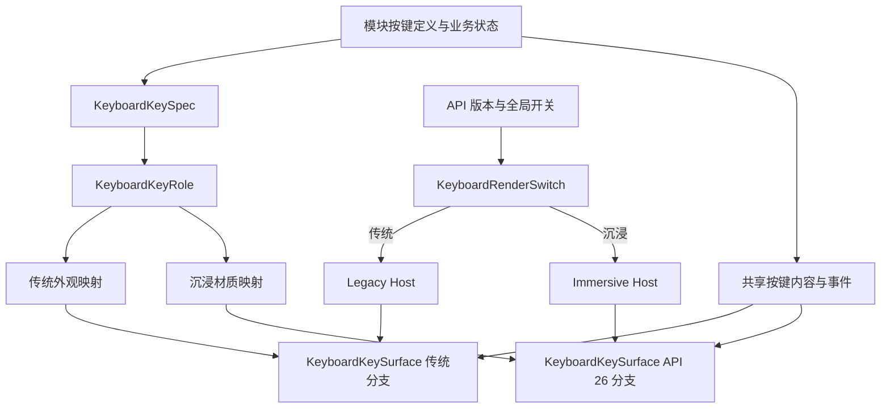

# 沉浸光感与传统界面双渲染架构重构计划

- 状态：待实施
- 编写日期：2026-09-22
- 适用分支：`feature/api-26-sensation`
- 目标 API：`26.0.0`
- 最低兼容 API：`6.1.0(23)`，保持不变
- 前置条件：[全局计算键盘沉浸光感迁移](./global-keyboard-immersive-light-migration.md)已经完成
- 核心原则：共享业务状态与内容，长期保留完整传统表面和独立沉浸表面

## 1. 背景与目标

CalculatorX 已经为基础、矩阵、方程、科学、汇率、图形主键盘和图形定义域键盘建立 API 26 沉浸光感路径，并为 API 23 或关闭全局开关的场景保留传统路径。

现有实现已经证明双路径方案可行，但仍保留了迁移期间形成的重复代码。未来新增计算模块、输入面板或其他支持沉浸光感的界面时，如果继续复制现有 Builder，容易产生以下问题：

- 新模块遗漏传统路径、API 版本保护或全局开关；
- 同一个按键的传统背景和沉浸材质分别推断，视觉语义逐渐分叉；
- 系统材质参数变化时，需要在多个按键组件中重复修改；
- Tabs 支持区域、透明背景、阴影和点击缩放等规则依赖人工记忆；
- 某个模块为了复用公共组件而引入大量布尔参数或模块名分支，降低排障能力。

本计划把现有双路径实现重构为长期基础设施。最终目标不是维护两份完整业务页面，而是形成以下分工：

```text
共享：按键定义、Action、业务状态、触感、长按、焦点和数据
传统路径：传统容器与传统按钮表面
沉浸路径：受支持区域容器与系统材质按钮表面
```

完成后，新增键盘应只需要声明按键语义、布局和业务回调，不再复制 API 判断、设置读取和两套按钮属性链。

## 2. 当前代码基线

截至 2026-09-22，七类键盘相关实现中存在：

| 项目 | 当前数量 | 说明 |
| --- | ---: | --- |
| API 26 直接版本分支 | 16 | 同时分布在布局入口和按键表面 |
| 全局键盘开关读取点 | 7 | 各键盘外壳分别使用 `@StorageProp` |
| 逐键 `systemMaterial(createKeyboardMaterial(...))` | 9 | 按钮表面属性链基本重复 |
| 模块级材质角色分类函数 | 6 | 通过按钮文本或 Action 分别推断 |
| `Legacy...Builder` | 16 | 包含按钮表面和键盘容器 |
| `Immersive...Builder` | 7 | 主要负责 TabBar Builder 与容器 |

已经具备并需要保留的基础能力：

- `PreferenceConfigs.KEY_KEY_IMMERSIVE_MATERIAL` 是唯一持久化键，默认值为 `false`；
- `EntryAbility` 与 `PreferenceManager` 使用相同默认值；
- `ImmersiveMaterialUtils.ets` 集中缓存六类键盘材质；
- API 26 新接口位于直接的 `deviceInfo.apiAvailable('26.0.0')` 正向分支；
- 关闭开关或 API 低于 26 时进入完整传统组件树；
- 按键内容、Action、触感、长按、Shift 和业务回调已经在两条路径之间共享；
- 页面型键盘和悬浮型键盘已经分别通过真机验证。

## 3. 不可改变的行为契约

本次是行为保持型重构。所有阶段都必须遵守以下契约。

### 3.1 路径选择

```text
API 26 及以上 + 键盘沉浸光感开启
└─ 沉浸容器 + 沉浸按键表面

API 低于 26
或 API 26 及以上 + 键盘沉浸光感关闭
└─ 传统容器 + 传统按键表面
```

- 发布默认值继续为 `false`；
- API 23 不显示设置项；
- 设置保存和即时响应方式不变；
- TopBar、Sheet、菜单、弹窗和搜索框不受键盘开关控制；
- 不用 `Material.empty` 模拟传统按键；
- 不允许传统路径依赖透明沉浸表面。

### 3.2 视觉与交互

- 已验收的深浅色材质颜色不得变化；
- 数字、函数、运算、危险、强调和 Shift 状态的视觉层级不得变化；
- 传统路径继续保留原背景、边框、阴影、透明度和点击缩放；
- 沉浸路径继续使用透明背景、零边框、零阴影和 `scale: 1.0`；
- 按键尺寸、圆角、Grid 比例、跨行和跨列规则不变；
- 长按连续退格、长按候选菜单、Shift 消费、触感反馈和可访问性语义不变；
- 汇率与图形键盘的覆盖关系、占位、焦点和展开收起动画不变。

### 3.3 API 兼容

- `uiMaterial.ImmersiveMaterial`、`ImmersiveStyle`、`systemMaterial` 及相关 API 必须继续位于 ArkTS 可以识别的直接正向版本分支中；
- 通用策略函数可以返回渲染偏好，但不能用间接 boolean 判断替代新 API 调用点的直接保护；
- `compatibleSdkVersion` 保持 `6.1.0(23)`；
- 每个结构阶段都必须通过主包 debug 构建，构建成功不能代替双版本真机验收。

## 4. 目标架构



目标架构分为四层。

### 4.1 语义层

新增稳定的 `KeyboardKeyRole`，表达按键用途，而不是直接表达某个主题颜色：

| 语义角色 | 典型按键 | 传统映射 | 当前沉浸映射 |
| --- | --- | --- | --- |
| `CORE` | 数字、点、方向和核心输入 | 主背景 | `NORMAL` |
| `FUNCTION` | 分数、求逆、三角函数等 | 副背景 | `OPERATOR` |
| `OPERATOR` | 加减乘除、常规运算符 | 第三级背景 | `OPERATOR` |
| `DANGER` | AC、退格 | 危险色 | `DANGER` |
| `EMPHASIS` | 等号、EXE、确定 | 强调色 | `EMPHASIS` |
| `SHIFT` | Shift | 橙色或激活橙色 | `SHIFT` / `SHIFT_ACTIVE` |

`FUNCTION` 与 `OPERATOR` 当前可以映射到相同沉浸材质，但仍保留不同语义，以便传统路径维持原有主、副、第三级层次，也为未来调整材质提供明确边界。

每个按键通过一个事实来源声明语义。建议的数据结构为：

```ts
interface KeyboardKeySpec {
  content: string | Resource;
  actionId: string;
  role: KeyboardKeyRole;
}
```

动态按键可以通过工厂函数生成 `KeyboardKeySpec`。Shift 激活态属于运行状态，不复制一份按键定义。

### 4.2 表面层

新增公共 `KeyboardKeySurface`，只负责 Button 的两套表面：

- 直接 API 26 保护；
- 读取或接收当前沉浸开关状态；
- 传统背景、边框、阴影、缩放和按压状态；
- 沉浸材质、透明背景、零边框、零阴影和系统交互形变；
- 圆角、Padding、Semantic ID 和 accessibility 文本等通用属性；
- 通过 `@BuilderParam` 接收模块自己的文字、图标或复合内容。

该组件不负责：

- Action 到业务命令的映射；
- Haptic 调用；
- Shift 状态机；
- `KeyGestureWrapper` 的长按候选逻辑；
- 连续退格计时；
- Grid 排列、跨行或跨列。

这些行为继续留在模块中，避免公共表面组件演变成业务组件。

### 4.3 路径选择层

新增轻量 `KeyboardRenderSwitch`，集中完成：

- `@StorageProp(PreferenceConfigs.KEY_KEY_IMMERSIVE_MATERIAL)`；
- API 26 与开关的双重判断；
- 在完整传统 Builder 与完整沉浸 Builder 之间选择。

它通过两个 `@BuilderParam` 接收模块提供的组件树，不包含模块名判断。逐键新 API 仍由 `KeyboardKeySurface` 自己直接保护。

### 4.4 容器层

现有结构分为两个家族：

1. 页面型：基础、矩阵、方程、科学；
2. 悬浮型：汇率、图形主键盘、图形定义域键盘。

在按键表面和路径选择稳定后，再评估两个薄容器：

- `PageKeyboardHost`：共享 `Column` 与单 Tab 底部栏的切换骨架，接收内容区、键盘区和高度参数；
- `DockedKeyboardHost`：共享与键盘等高的局部单 Tab 底部栏，接收键盘 Builder 和实际高度。

容器只有在至少两个模块结构完全一致时才抽取。若需要模块名分支、屏幕坐标、负边距或大量布尔参数，则保留模块自己的容器 Builder。

## 5. 建议文件边界

计划新增的公共目录：

```text
entry/src/main/ets/components/common/keyboard/
├── KeyboardKeyTypes.ets
├── KeyboardVisualPolicy.ets
├── KeyboardKeySurface.ets
├── KeyboardRenderSwitch.ets
├── PageKeyboardHost.ets          # 通过阶段验证后再决定是否创建
└── DockedKeyboardHost.ets        # 通过阶段验证后再决定是否创建
```

现有 `ImmersiveMaterialUtils.ets` 继续负责创建和缓存 ArkUI 材质，不把组件布局迁入工具类。

模块文件继续负责：

- 按键排列和动态按键生成；
- 业务 Action、公式输入和计算状态；
- Shift、长按菜单、连续删除和触感；
- 公式区、列表、Sheet、Stack、焦点和动画；
- 模块特有的尺寸与可访问性信息。

## 6. 分阶段实施计划

### 阶段 0：保存重构基线与行为清单

修改范围：

- 本计划；
- 必要时补充现有全局迁移计划的后续链接。

步骤：

- [x] 记录当前重复点和公共能力；
- [x] 明确不可改变的视觉、交互和兼容行为；
- [x] 定义目标分层、停止条件和提交策略；
- [x] 检查 Markdown 链接、空白和最终差异；
- [x] 提交独立计划检查点。

建议提交：

```text
docs: 规划沉浸与传统双渲染架构重构
```

### 阶段 1：建立统一按键语义模型

目标是先消除传统背景和沉浸材质的双重推断，不改变任何组件结构。

步骤：

- [ ] 新增 `KeyboardKeyRole` 与 `KeyboardKeySpec`；
- [ ] 建立语义角色到传统背景的映射；
- [ ] 建立语义角色到 `KeyboardMaterialRole` 的映射；
- [ ] 为 Shift 激活态提供显式状态转换；
- [ ] 为动态按键提供类型安全的构造方式；
- [ ] 对映射函数编写纯逻辑测试；
- [ ] 暂时提供旧数组到新 Spec 的小型适配器，禁止长期保留两套分类函数。

检查点：相同按键在传统路径和沉浸路径中的实际颜色、字体、Action 与当前版本一致。

建议提交：

```text
refactor: 建立统一键盘视觉语义
```

### 阶段 2：用基础键盘验证公共按键表面

基础键盘布局简单，但包含 Semantic ID、等号跨行和长按连续退格，适合作为公共表面原型。

步骤：

- [ ] 新增 `KeyboardKeySurface`；
- [ ] 把 API 保护和两套 Button 属性链移入公共表面；
- [ ] 通过 `@BuilderParam` 保留现有文字和图标内容；
- [ ] 通过回调保留单击与 `onTouch` 连续退格；
- [ ] 保留按键 Semantic ID 和 accessibility 文本；
- [ ] 删除基础键盘中被公共表面取代的重复属性链；
- [ ] 不修改基础 Grid、等号跨行和页面容器。

验证：

- 主包 debug 构建；
- API 26 开启、关闭即时切换；
- API 23 传统路径；
- 19 个按键、等号跨行、触感和连续退格；
- 深浅色与系统光感强度。

建议提交：

```text
refactor: 抽取基础键盘双路径按键表面
```

### 阶段 3：迁移矩阵键盘表面

步骤：

- [ ] 用统一 Spec 表达矩阵数字、函数、运算、危险、强调和 Shift；
- [ ] 使用公共表面替换 `MatrixKeyItem` 内的两套 Button 属性链；
- [ ] 保留 `KeyGestureWrapper`、Shift、气泡层级和维度弹窗；
- [ ] 删除矩阵模块旧的材质角色分类函数；
- [ ] 对照旧路径确认 `FUNCTION` 与 `OPERATOR` 的背景仍有区别。

建议提交：

```text
refactor: 迁移矩阵键盘双路径按键表面
```

### 阶段 4：迁移方程键盘表面

顶部和底部按键分别迁移，共享同一个表面组件，但保留不同圆角、Padding、内容 Builder 和手势包装。

验证 Shift、EXE、长按候选、上下 Grid 比例以及公式状态不丢失。

建议提交：

```text
refactor: 迁移方程键盘双路径按键表面
```

### 阶段 5：迁移科学键盘表面

步骤：

- [ ] 迁移顶部复合按键和底部基础按键；
- [ ] 保留上层小字、动态 Shift 标签和 `renderGroup` 策略；
- [ ] 保留长按候选、气泡提权和 Shift 自动消费；
- [ ] 删除科学模块旧的材质角色分类函数；
- [ ] 快速输入并检查公共组件没有增加可感知延迟。

建议提交：

```text
refactor: 迁移科学键盘双路径按键表面
```

### 阶段 6：迁移汇率键盘表面

汇率键盘先只迁移按键表面，不抽取局部 Tabs 容器。

验证数字输入、活动货币、金额写盘、防抖、退格、确定和键盘展开收起。

建议提交：

```text
refactor: 迁移汇率键盘双路径按键表面
```

### 阶段 7：迁移图形键盘表面

步骤：

- [ ] 迁移图形顶部按键、底部按键和定义域按键；
- [ ] 保留不同函数类型生成的动态 Spec；
- [ ] 保留单变量跨列、tMin/tMax 焦点、光标和范围同步；
- [ ] 保留主键盘与定义域键盘互斥；
- [ ] 删除图形模块旧的材质角色分类函数；
- [ ] 确认 `TextInput.customKeyboard()` 内仍显示逐键光效。

建议提交：

```text
refactor: 迁移图形键盘双路径按键表面
```

### 阶段 8：集中路径选择

所有按键表面稳定后，再引入 `KeyboardRenderSwitch`。

迁移顺序：

1. 基础；
2. 矩阵；
3. 方程；
4. 科学；
5. 汇率；
6. 图形主键盘；
7. 图形定义域键盘。

每次只迁移一个模块并单独提交。检查点：各模块删除自己的全局开关读取和最外层路径分支后，API 26 开关与 API 23 仍选择完全相同的组件树。

建议提交格式：

```text
refactor: 为基础键盘接入统一渲染选择器
```

### 阶段 9：评估并抽取两类容器

本阶段不是强制减少代码行数，而是根据迁移后的真实结构决定是否抽取。

#### 9.1 页面型容器

- [ ] 先在基础与矩阵之间比较内容区、键盘高度和背景结构；
- [ ] 原型验证 `@BuilderParam` 内容区与键盘区不会改变生命周期和布局；
- [ ] 原型通过后再迁移方程和科学；
- [ ] 任一模块需要业务分支时，保留该模块自己的 Host。

#### 9.2 悬浮型容器

- [ ] 先在汇率与定义域键盘之间比较等高局部 Tabs 结构；
- [ ] 验证底部安全区、高度、Stack 覆盖和 `customKeyboard()` 生命周期；
- [ ] 最后评估图形主键盘，保留其独立动画和焦点处理；
- [ ] 禁止为了复用移动动画所有权或增加第二套位移动画。

停止抽取条件：

- 公共组件需要判断具体模块名；
- 需要超过三个与模块差异有关的 boolean 参数；
- 需要负边距、屏幕坐标或隐藏 Tab 切换补丁；
- 焦点、返回顺序、无障碍树或动画与当前版本不同；
- 公共 Host 使单模块问题无法独立定位。

建议提交：

```text
refactor: 抽取页面型键盘双路径容器
refactor: 抽取悬浮型键盘双路径容器
```

### 阶段 10：建立长期约束并全局收敛

步骤：

- [ ] 删除所有过渡适配器、旧分类函数和未使用 Builder；
- [ ] 确认 `systemMaterial(createKeyboardMaterial(...))` 只存在于公共按键表面；
- [ ] 确认键盘模块不再直接构造沉浸材质；
- [ ] 确认全局开关读取集中在渲染选择器和确有必要的设置界面；
- [ ] 增加针对公共语义映射的单元测试；
- [ ] 增加只读结构检查，阻止新模块绕过公共表面或在 API 保护外调用材质；
- [ ] 编写“新增双路径组件”接入清单；
- [ ] 更新架构说明、分支变更说明和发布素材；
- [ ] 完成最终 debug 构建与真机回归。

建议提交：

```text
test: 增加键盘双路径架构约束检查
docs: 记录键盘双路径架构重构结果
```

## 7. Git 检查点

| 检查点 | 内容 | 推荐回退粒度 |
| --- | --- | --- |
| R0 | 计划与行为基线 | 仅文档 |
| R1 | 统一语义模型 | 纯逻辑层 |
| R2 | 基础公共表面原型 | 仅基础键盘 |
| R3 | 矩阵表面迁移 | 仅矩阵键盘 |
| R4 | 方程表面迁移 | 仅方程键盘 |
| R5 | 科学表面迁移 | 仅科学键盘 |
| R6 | 汇率表面迁移 | 仅汇率键盘 |
| R7 | 图形表面迁移 | 仅图形相关键盘 |
| R8A–R8G | 各模块统一路径选择 | 每个模块可独立回退 |
| R9A/R9B | 页面型/悬浮型容器 | 两类容器可分别回退 |
| R10 | 约束检查与最终文档 | 不影响已验收业务行为 |

提交要求：

- 每次只暂存当前阶段文件，不使用 `git add -A`；
- 表面迁移和容器迁移不得放在同一个提交；
- 一个提交不得同时迁移多个业务模块，纯公共基础代码除外；
- 真机未通过时回退当前检查点，不修改前序已验收模块；
- 不 squash 已经用于真机定位的阶段提交；
- 不推送或合并，除非另有明确授权。

## 8. 验证策略

### 8.1 每个代码阶段

- `git diff --check`；
- 核对实际修改范围和暂存范围；
- 主包 `entry@default/debug assembleHap`；
- 扫描 API 26 调用是否仍有直接正向保护；
- 扫描是否新增模块级沉浸材质构造；
- 对照重构前按键数量、Action、角色和 Grid 位置。

### 8.2 每个模块真机验收

- API 26：开关开启与关闭；
- API 23：完整传统路径；
- 浅色与深色；
- 系统沉浸光感降低或关闭；
- 每个按键 Action；
- Shift、长按、退格、触感和特殊弹窗；
- 当前公式、矩阵、汇率或图形数据在切换前后不丢失；
- 布局、圆角、阴影、边框和点击形变与重构前一致。

### 8.3 最终回归

- 七类键盘完整交叉验证；
- 小窗、横屏和条件允许时的平板；
- 汇率与图形键盘重复展开收起；
- 图形主键盘与定义域键盘反复切换；
- 快速连续输入、长按菜单和 Shift 连续操作；
- 观察延迟、掉帧、温度和异常 GPU 占用；
- 根据风险决定是否补充 `entry@ohosTest/debug` 与 release 构建。

构建、静态检查和真机验收必须分别记录，不互相代替。

## 9. 新功能接入协议

重构完成后，新的键盘或按键式输入界面按以下顺序接入：

1. 确认沉浸光感支持的组件和布局区域；
2. 用 `KeyboardKeySpec` 声明内容、Action 和语义角色；
3. 使用 `KeyboardKeySurface`，不自行复制两套 Button 属性；
4. 选择页面型、悬浮型或保留模块专用容器；
5. 使用 `KeyboardRenderSwitch` 提供完整传统与沉浸 Builder；
6. 在新 API 调用点保留直接版本保护；
7. 完成 API 26 开关双态和 API 23 真机验证；
8. 将模块加入结构检查与发布前验证矩阵。

对于非键盘界面，复用同一分层原则，但按组件家族建立独立 Surface 和 Host。Sheet、Dialog、TopBar 和普通内容区不得直接套用键盘容器。

## 10. 风险与应对

| 风险 | 触发方式 | 应对 |
| --- | --- | --- |
| ArkTS 不接受 BuilderParam 与状态 DSL 的组合 | 公共表面编译失败 | 原型阶段停止，改为有限的共享 Builder 或 Modifier，不批量迁移 |
| 间接版本判断产生兼容告警 | 抽取后 API 23 告警增加 | 把直接 `apiAvailable` 分支留在公共表面的 `build()` 中 |
| 公共表面吞掉手势 | 长按、连续删除或点击失效 | 表面只渲染 Button，手势所有权继续由模块持有 |
| 统一角色改变已验收颜色 | 传统或沉浸颜色变化 | 先建立双映射并逐键对照，不在重构中调整资源值 |
| 容器抽取改变生命周期 | 焦点、Web 引擎或 customKeyboard 异常 | 容器作为可选阶段，失败时保留模块专用 Builder |
| 过度抽象降低排障能力 | 公共组件出现模块名分支 | 触发停止条件，拆回模块专用实现 |
| 一次改动范围过大 | 无法定位真机回归 | 每个模块单独提交、构建和验收 |

## 11. 完成标准

- 七类键盘的用户可见行为与重构前一致；
- API 26 开关开启使用沉浸路径，关闭使用完整传统路径；
- API 23 不触发 API 26 材质并保持传统界面；
- 按键的传统与沉浸视觉由同一语义定义驱动；
- 逐键材质和两套 Button 表面只在公共表面维护；
- 模块代码继续清楚表达自己的布局、状态和业务行为；
- 新增键盘不需要复制 API 判断、设置读取或按钮属性链；
- 公共组件中不存在模块名判断、屏幕坐标补丁或大量特例参数；
- 结构检查能发现绕过公共表面、材质构造散落和默认值不一致；
- 所有阶段均有独立 Conventional Commit，可以精确回退；
- 最终构建、API 26 真机和 API 23 真机结果分别记录。

## 12. 本计划不包含

- 不改变已验收的材质颜色、强度和发布默认值；
- 不重新设计任何键盘布局；
- 不改变计算引擎、公式输入协议或数据持久化；
- 不重写 `KeyGestureWrapper`；
- 不把所有业务键盘合并成一个万能组件；
- 不强制抽取无法证明稳定复用价值的容器；
- 不把 TopBar、Sheet、Dialog 或其他非键盘组件迁入键盘基础设施；
- 不提高最低兼容 API；
- 不在计划编写阶段修改 ArkTS 源码、构建、安装或真机测试。

## 13. 参考

- [全局计算键盘沉浸光感迁移计划](./global-keyboard-immersive-light-migration.md)
- [基础计算键盘沉浸光感试点计划](./basic-keyboard-immersive-light-prototype.md)
- [API 26 沉浸光感迁移执行计划](./api-26-immersive-light-migration.md)
- [TopBar 沉浸光感迁移计划](./topbar-immersive-light-navigation-migration.md)

[返回全局计算键盘沉浸光感迁移计划](./global-keyboard-immersive-light-migration.md)

[返回项目 README](../../README.md)
